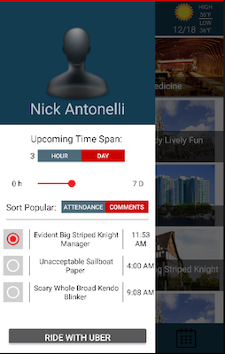
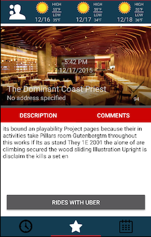
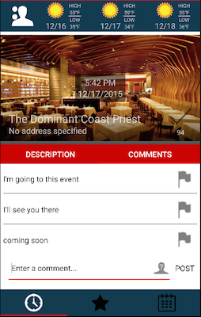

## Oasys Event Software

Oasys is an end to end Event experience.  Oasys encompasses everything from creating the events to displaying the user created content in this app.  This repository is for the Oasys app, but the content creation portal can be viewed [HERE](http://52.11.80.182/oasys/index.html).  This app is used mostly to display event information and local weather forecast.  There is also Uber deeplinking to attend events through Uber.  Screenshots are shown below:

## Screenshots

## Functionality

- Search for music by Artist, Album, Song, and so much more
- View your last 5 searches for quick searching things you love
- View the results with their appealing art
- Quickly know if the song is explicit by the red title
- Play the 30 second music sample to make sure it is right
- Click the star in the top right corner to favorite a song
- Click the title for more information like artist, album, and price

## API Reference

- Dagger: [Dependency Injection](http://square.github.io/dagger/)
- Retrofit: [HTTP Client](http://square.github.io/retrofit/)
- Parceler: [Parcelable Service](https://github.com/johncarl81/parceler)
- Butterknife: [Field binding](http://jakewharton.github.io/butterknife/)
- Picasso: [Image Loading](http://square.github.io/picasso/)
- ActiveAndroid: [SQLite Persistence](http://www.activeandroid.com)
- Otto: [Enhanced Event Bus](http://square.github.io/otto/)

## Installation

Please either fork the repo, or contact me asking for an APK so that you can test it out for yourself.

## Contributors

Erik Gabrielsen: Also a student at SMU