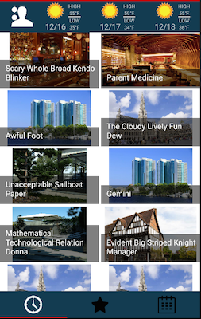

## Oasys Event Software

Oasys is an end to end Event experience.  Oasys encompasses everything from creating the events to displaying the user created content in this app.  This repository is for the Oasys app, but the content creation portal can be viewed [HERE](http://52.11.80.182/oasys/index.html).  This app is used mostly to display event information and local weather forecast.  There is also Uber deeplinking to attend events through Uber.  Screenshots are shown below:

## Screenshots

## Functionality

- Image Focussed Design
- View Events in the Dallas area
- View events by upcoming events in time sorted order (soonest first)
- View events by popularity.  Either through number of comments or attendees
- View events that you are planning on attending.
- View the weather forecast for the next 3 days. Provided by Weather Underground
- Weather included because the conditions outside are very important considerations when going out
- Change the time span for how many upcoming events are displayed
- Select one of your upcoming events that you are attending and rider there with Uber deeplinking
- View Event specific details like start time and date
- Socially focussed event information
- Click the checkmark to attend the event
- Comment on an event to show your interest
- View all other users comments
- So much more great functionality

## API Reference

- Dagger: [Dependency Injection](http://square.github.io/dagger/)
- Retrofit: [HTTP Client](http://square.github.io/retrofit/)
- Parceler: [Parcelable Service](https://github.com/johncarl81/parceler)
- Butterknife: [Field binding](http://jakewharton.github.io/butterknife/)
- Picasso: [Image Loading](http://square.github.io/picasso/)
- Uber: [Deep Linking](https://developer.uber.com/v1/deep-linking/)
- GSON: [Serialization Library](https://github.com/google/gson)
- Otto: [Enhanced Event Bus](http://square.github.io/otto/)

## Installation

Please either fork the repo, or contact me asking for an APK so that you can test it out for yourself.
